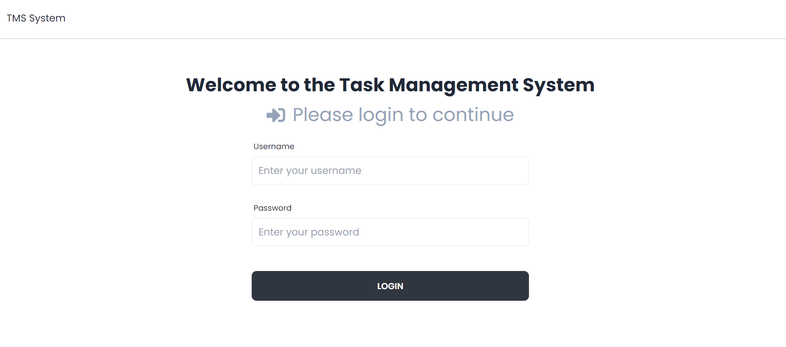
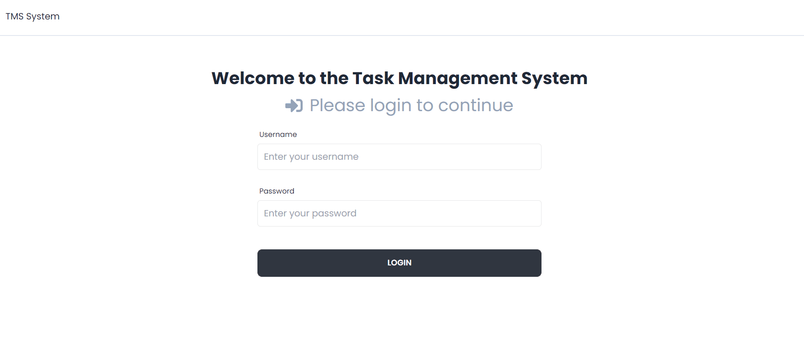
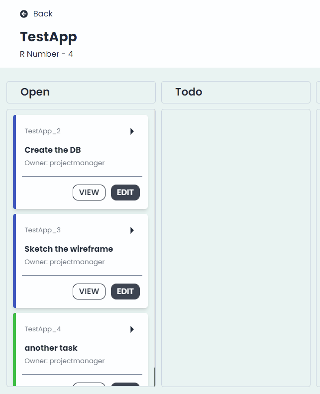
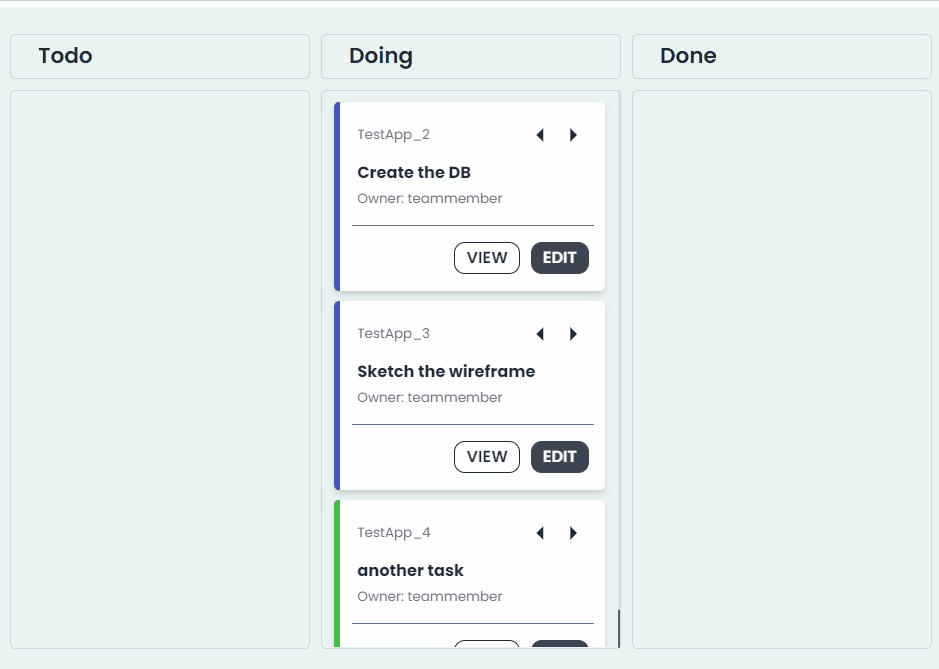

# Task Management System
A Kanban board app to help visualize work, built with the **React, NodeJS, express and MySQL**. Made as part of the basic training for Software Engineers at ST Engineering.

Click <a href="#demo">here</a> for short demo. 

## Built with
* [ReactJS](https://reactjs.org/docs/getting-started.html) - Client-side framework for highly reactive user interface
* [Tailwind CSS](https://tailwindcss.com/) - for utility-first CSS classes and responsive styling
* [Daisy UI](https://daisyui.com/) - a Tailwind CSS component library, for cleaner HTML.
* [NodeJS](https://nodejs.org/en/) - Server-side/Backend JavaScript runtime environment
* Express - NodeJS Framework for simplifying writing of server-side code & logic
* [MySQL](https://www.mysql.com/) - Relational database management system (RDBMS) for storing a collection of structured data

## Tools used
* [Visual Studio Code](https://code.visualstudio.com/) - for code editing
* [MySQL Workbench](https://www.mysql.com/products/workbench/) - a visual database design tool
* [Postman](https://www.postman.com/) - A HTTP client with a graphical user interface for API testing. It can send and receive HTTP requests and responses
* [Git](https://git-scm.com/) - Distributed version control system: tracking changes in any set of files
* GitHub - code hosting platform

## Features
* Login system
* User Management for admin users
* Kanban board for task management
* RESTful API 

## Demo

* **An admin can create a user**

 

* **Users can edit their email and passwords**

 

* **A Project Lead can create an application, navigate into the Kanban board for the application, and create tasks**

 

* **A Project Manager can create plans and assign them to existing tasks**

 

* **A Project Manager can promote a task to "to-do"**

 

* **A Team Member can pick up a task and promote it to "doing"**

 

* **A Team Member can either promote the task in "doing" to "done", or demote it to "todo"**

