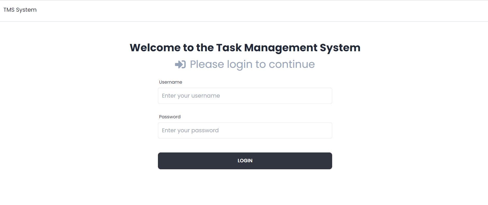

# Task Management System
A Kanban board app to help visualize work, built with the **React, NodeJS, express and MySQL**.

Click <a href="#demo">here</a> for short demo. 

## Technologies
### Frontend
* [ReactJS](https://reactjs.org/docs/getting-started.html) - Client-side framework for highly reactive user interface
* **Axios** - a promise-based HTTP Client for node.js and the browser
* [Tailwind CSS](https://tailwindcss.com/) - for utility-first CSS classes and responsive styling
* [Daisy UI](https://daisyui.com/) - a Tailwind CSS component library, for cleaner HTML.
* **react-toastify** - a React library that allows the adding of toast notifications to be used as notifications and alerts.

### Backend
* [NodeJS](https://nodejs.org/en/) - Server-side/Backend JavaScript runtime environment
* **Express** - NodeJS Framework for simplifying writing of server-side code & logic
* **cors** - a mechanism or a protocol that allows devices on one domain to access resources residing on other domains.
* **bcryptjs** - to hash passwords for storing in the database
* **jsonwebtoken** - a compact and self-contained way for securely transmitting information between two parties as a JSON object
* **nodemailer** - a js module that allows the sending of emails from a Node server to notify users when something has happened
* [MySQL](https://www.mysql.com/) - Relational database management system (RDBMS) for storing a collection of structured data

## Tools used
* [Visual Studio Code](https://code.visualstudio.com/) - for code editing
* [MySQL Workbench](https://www.mysql.com/products/workbench/) - a visual database design tool
* [Postman](https://www.postman.com/) - A HTTP client with a graphical user interface for API testing. It can send and receive HTTP requests and responses
* [Git](https://git-scm.com/) - Distributed version control system: tracking changes in any set of files
* **GitHub** - code hosting platform

## Features
1. **Login system**
2. **User Management for admin users**
    1. Create a new user
    2. Reset account details (email, password, groups, active/inactive status)
3. **Kanban board for task management**
4. **RESTful API** 

## Demo

* **An admin can create a user**

 

* **Users can edit their email and passwords**

 

* **A Project Lead can create an application, navigate into the Kanban board for the application, and create tasks**

 

* **A Project Manager can create plans and assign them to existing tasks**

 

* **A Project Manager can promote a task to "to-do"**

 

* **A Team Member can pick up a task and promote it to "doing"**

 

* **A Team Member can either promote the task in "doing" to "done", or demote it to "todo"**

